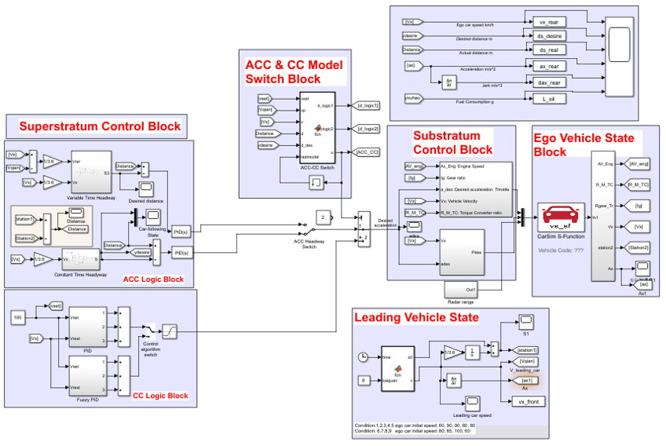

# Adaptive-Cruise-Control-System-Modelling
ACCS modelling with Matlab/Simulink &amp; Carsim;

For implementation detals, please check the PPT file.
The Simulinke model was uploaded.
Although the Carsim model was not able to be uploaded, you can select a preferred vehicle model in Carsim in your experiments.

If it helps your academic work, please cite the following paper, appreciate it!

Tian, Zhaofeng, Liangkai Liu, and Weisong Shi. "A pulse‐and‐glide‐driven adaptive cruise control system for electric vehicle." International Transactions on Electrical Energy Systems 31.11 (2021): e13054.
